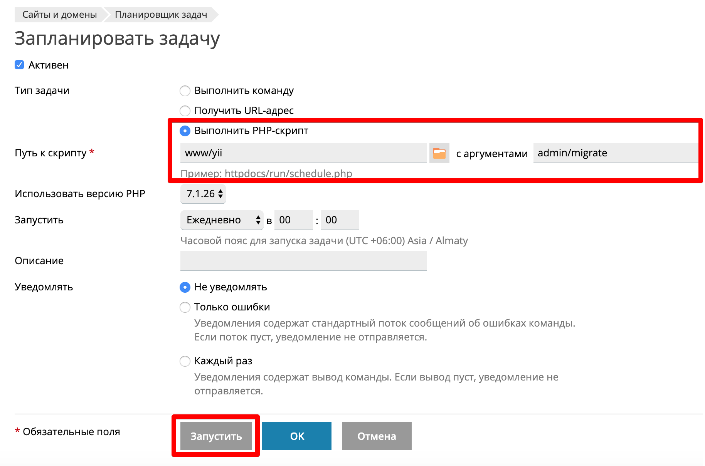

# Yii2 Bridge Migrate Command

If you cannot start `yii2-bridge/core` migrations using a terminal (especially if your project is on a shared hosting), install this package and start migrating via `php`.

## Installation

### Composer

The preferred way to install this extension is through [Composer](http://getcomposer.org/).

Either run: 
```
composer require yii2-bridge/migrate-command:^0.1
```

or add `"yii2-bridge/migrate-command": "^0.1"` to the require section of your `composer.json`

### Using

Add a module `Bridge\Migrate\Modules\Module` in the configuration file of the console application to the modules section of the admin module:

```php
'console' => [
    ...    
    'modules' => [
        'admin' => [
            'class' => \Bridge\Core\BridgeModule::class,
            'modules' => [
                'migrate' => [
                    'class' => 'Bridge\Migrate\Modules\Module',
                ],
            ],
            ...
        ]
    ],
    ...
]
```

To start the migration, just run the command:
```
php yii admin/migrate
```

---

If you want to run migrations on a shared hosting, you can run as php script through cron.  
For example for shared hosting PS.kz:


## Author

[Altynbek Kazezov](https://github.com/altynbek07/), e-mail: [altynbek.kazezov.97@gmail.com](mailto:altynbek.kazezov.97@gmail.com)